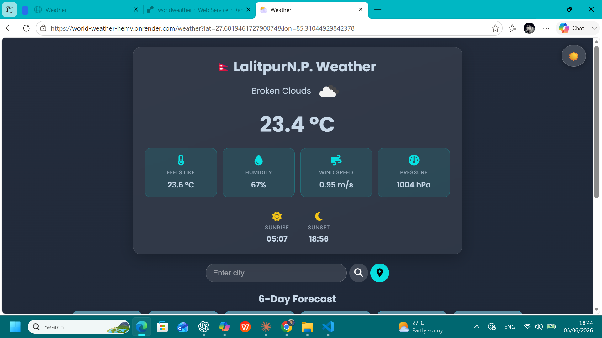
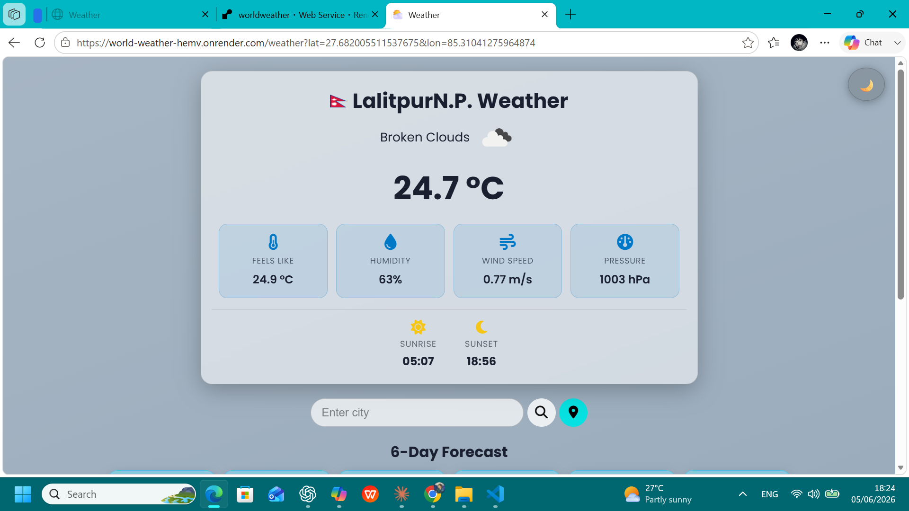
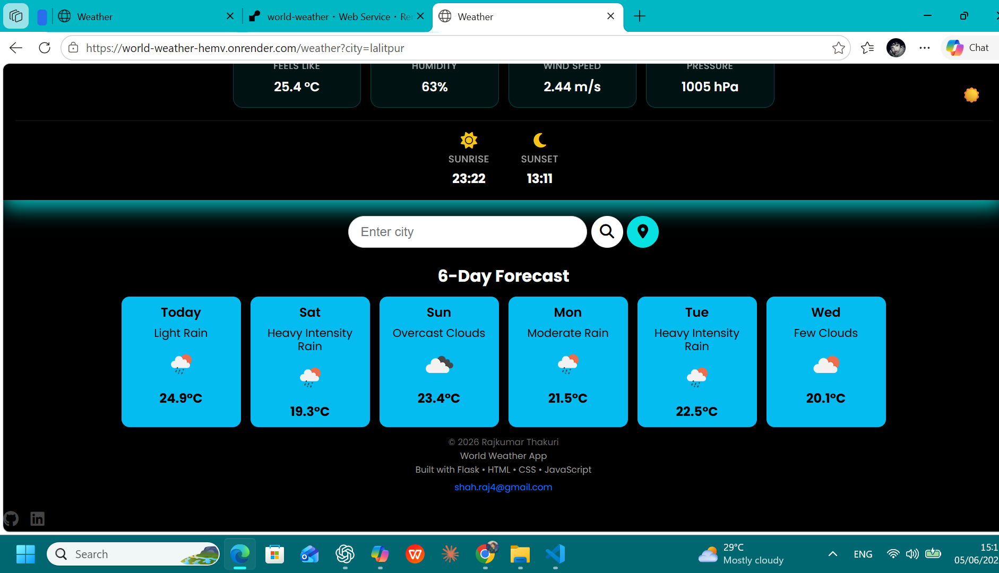
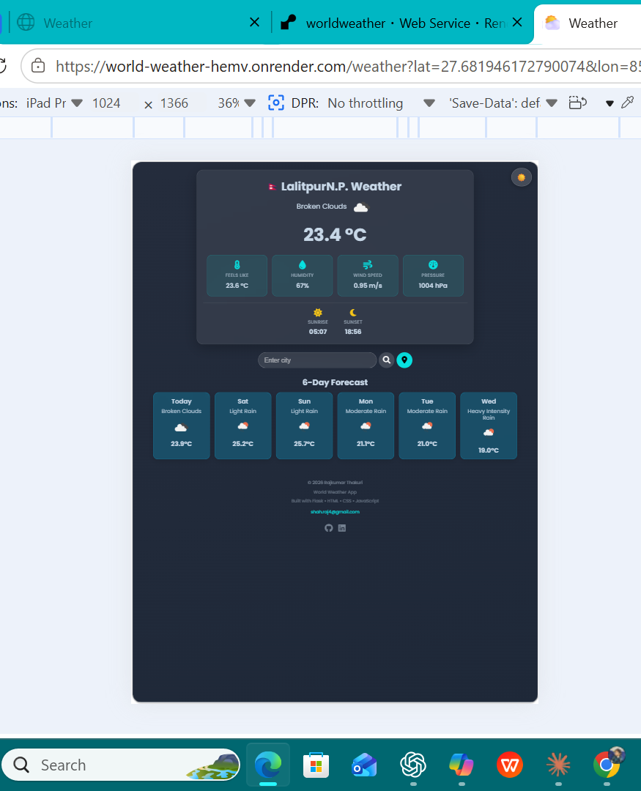
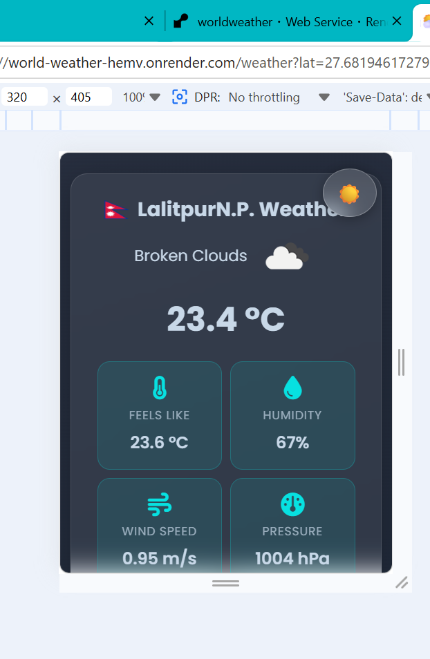
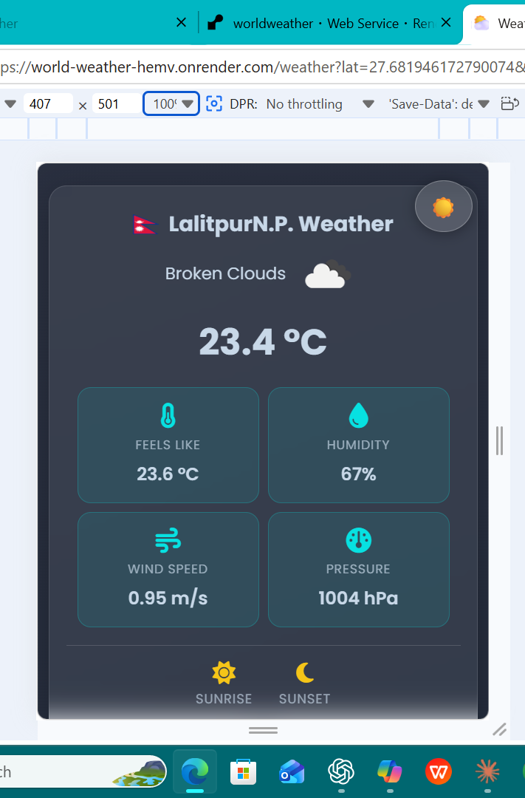

# 🌦️ World Weather App

A simple and modern weather web application that shows real-time weather information for any city using a weather API.

## Live

https://world-weather-hemv.onrender.com

## Features:-

* Search weather by city name
* Displays temperature, humidity, and weather condition
* Dynamic UI updates using JavaScript
* Clean and responsive design
* Error handling for invalid or not found cities
* Fast Flask-based backend

---

## 🛠️ Technologies Used

* Python (Flask)
* HTML5
* CSS3
* JavaScript
* Weather API (OpenWeatherMap or similar)

---

## 📁 Project Structure

---
worldWeather/
│── static/
│   ├── styles/
│   └── Scripts/
│── templates/
│   ├── weather.html
│── server.py
│── weather.py
│── README.md
---
## Screenshots

### Home Page

### Light Mode

### 6Days forecast

### Search City

### iPad View

### Mobile View

### Samsung Mobile View

